# Neural Network Performance in Predicting a Simple Mass–Spring System

A hands-on comparison of an **MLP**, a **CNN**, and an **RNN** — all trained *without any knowledge of the governing physics* — on the task of reproducing the motion of a linearly damped, sinusoidally forced mass–spring oscillator. The goal is not to build the best possible predictor, but to directly experience, in code, where and why "black-box" neural networks fail on a physical dynamical system — motivating the case for **Physics-Informed Neural Networks (PINNs)**.

> This project was completed as an assignment to explore, first-hand, why architectures with no governing ODE constraint struggle on physical systems before implementing a PINN. Several of the results below are **intentional failure cases**, not bugs.

---

## Table of Contents

1. [Problem Definition](#1-problem-definition)
2. [Repository Structure](#2-repository-structure)
3. [Methodology](#3-methodology)
   - [3.1 Physics Simulation (`physics.ipynb`)](#31-physics-simulation-physicsipynb)
   - [3.2 MLP (`mlp.ipynb`)](#32-mlp-mlpipynb)
   - [3.3 CNN (`cnn.ipynb`)](#33-cnn-cnnipynb)
   - [3.4 RNN (`rnn.ipynb`)](#34-rnn-rnnipynb)
   - [3.5 PINN (`pinn.ipynb`)](#35-pinn-pinnipynb)
4. [Results and Discussion](#4-results-and-discussion)
5. [Summary Comparison](#5-summary-comparison)
6. [Key Takeaway: Data-Driven Models vs. PINNs](#6-key-takeaway-data-driven-models-vs-pinns)
7. [How to Reproduce](#7-how-to-reproduce)
8. [Limitations and Future Work](#8-limitations-and-future-work)
9. [Requirements](#9-requirements)

---

## 1. Problem Definition

The system under study is a single-degree-of-freedom, linearly damped, sinusoidally forced mass–spring oscillator, governed by:

$$m\ddot{x} + c\dot{x} + kx = F(t)$$

**Physical parameters:**

| Symbol | Meaning | Value |
|---|---|---|
| $m$ | Mass | 1 kg |
| $c$ | Damping coefficient | 0.4 N·s/m |
| $k$ | Spring stiffness | 4 N/m |
| $F(t)$ | Forcing function | $2\sin(1.5t)$ N |
| $x(0)$ | Initial displacement | 0 m |
| $\dot{x}(0)$ | Initial velocity | 0 m/s |

Substituting these values gives the specific governing equation used throughout this project:

$$\ddot{x} + 0.4\dot{x} + 4x = 2\sin(1.5t)$$

The system is simulated over $t \in [0, 20]$ s at 2000 evenly spaced points ($\Delta t \approx 0.01$ s), producing a transient response (first ~3 cycles) that settles into a steady-state oscillation with amplitude of roughly **±1.3 m** and angular frequency $\Omega = 1.5$ rad/s ($T \approx 4.19$ s).

**Task for every architecture:** given only the simulated data (no access to $m$, $c$, $k$, or the ODE itself), learn to reproduce $x(t)$.

---

## 2. Repository Structure

```
.
├── physics.ipynb           # Ground-truth simulation: numerical + analytical solution
├── mass_spring_data.csv    # Generated dataset (time, force, displacement, velocity)
├── mlp.ipynb                # Coordinate-regression MLP: t → x(t)
├── cnn.ipynb                # Windowed 1D-CNN forecaster: x(t-50..t-1) → x(t)
├── rnn.ipynb                # Windowed vanilla RNN forecaster: x(t-50..t-1) → x(t)
├── pinn.ipynb               # Physics-Informed Neural Network: ODE + initial conditions → x(t)
├── assets/                  # Figures referenced by this README
└── README.md
```

Each `.ipynb` is self-contained and can be run independently once `mass_spring_data.csv` exists (generated by `physics.ipynb`).

---

## 3. Methodology

### 3.1 Physics Simulation (`physics.ipynb`)

The governing ODE is solved two ways, both implemented from scratch:

1. **Numerical solution** — the second-order ODE is written as a first-order system $[\dot{x}, \dot{v}]$ and integrated with SciPy's `solve_ivp`.
2. **Analytical solution** — the closed-form solution (transient homogeneous term + particular steady-state term) is derived and evaluated directly:

$$x(t) = e^{-0.2t}\left(C_1\cos(\omega_d t) + C_2\sin(\omega_d t)\right) + A\sin(1.5t) + B\cos(1.5t)$$

with $\omega_d = \sqrt{3.96}$, $A = 1400/1369$, $B = -480/1369$.

The two solutions are compared directly to validate the simulation before it's used as ground truth for any network.

| Displacement | Velocity | External Force |
|---|---|---|
| 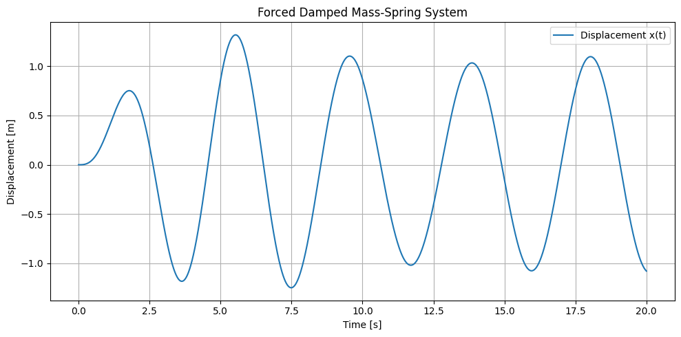 | 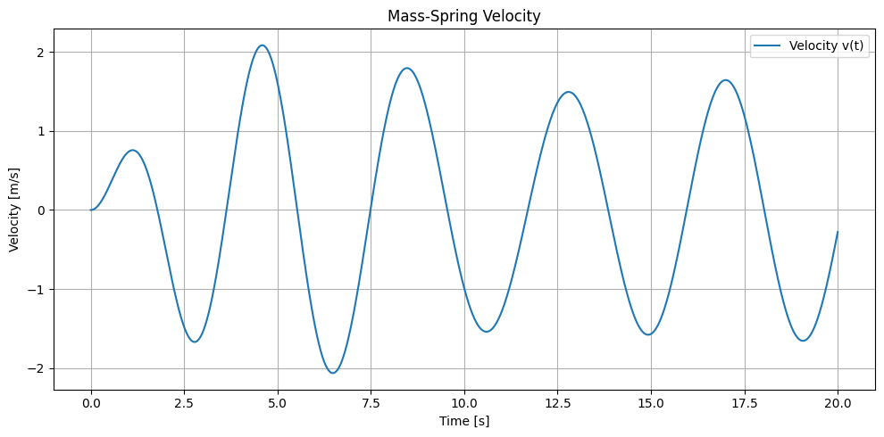 | 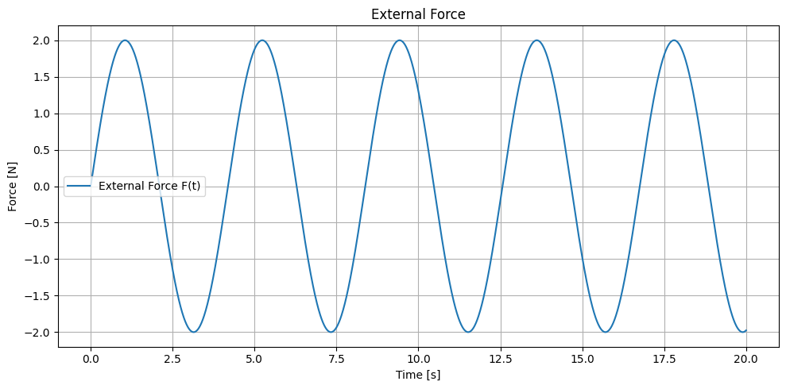 |

**Validation — analytical vs. numerical:**

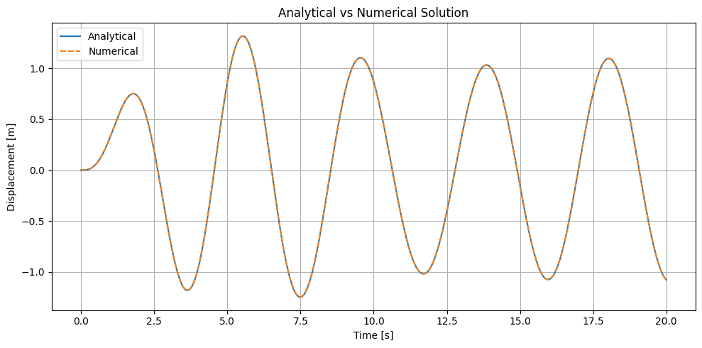

**Maximum analytical/numerical error: `1.961e-03 m`** — the numerical simulation is trustworthy and used as the single source of ground truth (`mass_spring_data.csv`) for every network below.

---

### 3.2 MLP (`mlp.ipynb`)

**Formulation:** a *coordinate regression* problem. The network receives **only the raw time value** $t$ and must directly output the displacement:

$$t \;\longrightarrow\; x(t)$$

No history, no local structure — the MLP has to learn the entire shape of the trajectory as a single continuous function of a scalar input.

**Architecture:**
```
Linear(1 → 32) → Tanh → Linear(32 → 32) → Tanh → Linear(32 → 1)
```
- Loss: MSE · Optimizer: Adam (default lr) · Epochs: 5000
- Trained on the **entire** trajectory (no train/test split — this is a pure function-fitting exercise, so performance here reflects the model's ability to fit the data it can already see, not generalize to unseen time values)

---

### 3.3 CNN (`cnn.ipynb`)

**Formulation:** re-cast as a *windowed time-series forecasting* problem — the CNN is given a short trailing history of the signal and asked to predict the very next point:

$$[x(t_0), x(t_1), \dots, x(t_{49})] \;\longrightarrow\; x(t_{50})$$

A sliding window of **50 samples (~0.5 s)** is used, producing 1950 (input, target) pairs, split **70/30** into train/test sets (1365 / 585 samples).

**Architecture:**
```
Conv1d(1→16, k=5) → Tanh → Conv1d(16→32, k=5) → Tanh → Flatten → Linear(1344→64) → Tanh → Linear(64→1)
```
- Loss: MSE · Optimizer: Adam (lr = 0.001) · Batch size: 32 · Epochs: 50

Two evaluation modes are used:
- **One-step (teacher-forced):** at every test point, the model is given the *true* preceding 50 values.
- **Autoregressive rollout:** the model is seeded with the true 50 values at the start of the test region only, then must generate the rest of the trajectory using **its own predictions** as future input — no ground truth is fed in again.

---

### 3.4 RNN (`rnn.ipynb`)

**Formulation:** identical windowed forecasting setup to the CNN — same window size, same 70/30 split, same two evaluation modes — but processed with a sequential architecture designed to carry state across time steps rather than treat the window as a flat vector.

**Architecture:**
```
RNN(input_size=1, hidden_size=32, num_layers=1, batch_first=True) → take last time step → Linear(32→1)
```
- Loss: MSE · Optimizer: Adam (lr = 0.001) · Batch size: 32 · Epochs: 50

Using the same windowing and evaluation protocol as the CNN makes this the most direct architecture-vs-architecture comparison in the project.

---

### 3.5 PINN (`pinn.ipynb`)

**Formulation:** the same governing ODE, but a fundamentally different learning problem from the three models above. Instead of fitting simulated displacement data, the network learns a continuous function $x_\theta(t)$ constrained to satisfy the physical law and the initial conditions — **the simulated CSV data is never used as a training target**, only to score the result afterward.

$$t \;\longrightarrow\; x_\theta(t), \qquad \text{subject to} \qquad m\ddot{x}_\theta+c\dot{x}_\theta+kx_\theta=F(t),\ \ x_\theta(0)=0,\ \ \dot{x}_\theta(0)=0$$

**Architecture:**
```
Linear(1 → 32) → Tanh → Linear(32 → 32) → Tanh → Linear(32 → 32) → Tanh → Linear(32 → 1)
```

Raw time is normalized to $\tau = t/T \in [0,1]$ before entering the network, and automatic differentiation computes $dx/d\tau$ and $d^2x/d\tau^2$ from the network's own output; these are rescaled back to physical derivatives via $dx/dt = \tfrac{1}{T}\,dx/d\tau$ and $d^2x/dt^2 = \tfrac{1}{T^2}\,d^2x/d\tau^2$. The physics residual is

$$\mathcal{R}(t)=m\ddot{x}_\theta+c\dot{x}_\theta+kx_\theta-F(t)$$

and the training objective combines it with the initial-condition loss:

$$\mathcal{L}=\mathcal{L}_{\mathrm{physics}}+\lambda_{IC}\mathcal{L}_{IC}, \qquad \lambda_{IC}=10$$

**Training setup:** 2000 fixed collocation points spanning $\tau \in [0,1]$ · Adam, lr $=10^{-3}$ · **1,000,000 epochs** on CPU · reproducible via a fixed random seed (`torch.manual_seed(42)`).

This is a physics-informed counterpart to the purely data-driven models above: the network is never shown a single $(t, x)$ pair during training — it is only asked to produce a function that satisfies the differential equation and the two initial conditions everywhere on the domain.

---

## 4. Results and Discussion

### MLP: fails even at fitting data it has already seen

| Training Loss | Prediction vs. Ground Truth |
|---|---|
| 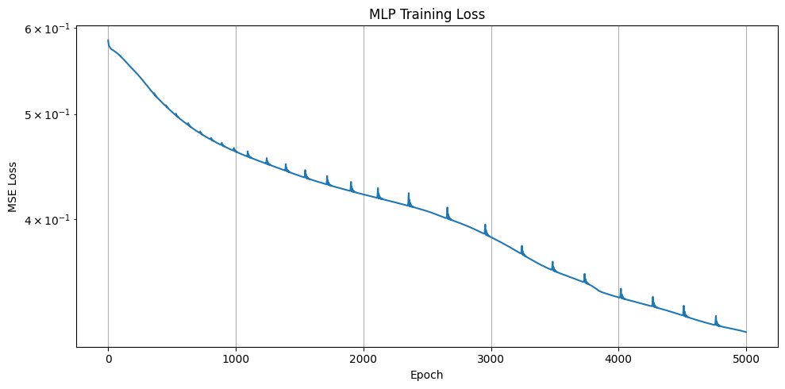 | 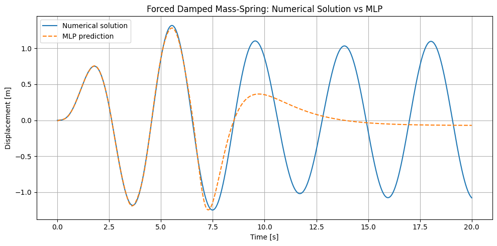 |

**Final performance: `MSE = 3.152e-01`, `RMSE = 5.615e-01` m** — against a signal whose amplitude is only ~1.3 m, this is a large error relative to the signal itself.

The loss curve tells the real story: after 5000 epochs it is *still decreasing* — the network never converges. Looking at the prediction plot, the MLP tracks the first two to three oscillation cycles (the strong transient) almost perfectly, then progressively flattens out and fails to reproduce the sustained steady-state oscillation for the remaining ~12 seconds — even though **every one of those points was part of its training data.** This isn't a generalization failure; it's a failure to fit at all.

Two compounding causes:

1. **No input normalization.** Raw $t \in [0, 20]$ is fed straight into `Tanh` layers. Without scaling, pre-activations grow large and gradients through saturated tanh units shrink, slowing optimization substantially.
2. **Spectral bias of coordinate MLPs.** It's a well-documented property of standard MLPs (see Tancik et al., *"Fourier Features Let Networks Learn High-Frequency Functions in Low-Dimensional Domains,"* 2020) that they are strongly biased toward learning low-frequency, slowly varying components of a function first. A raw scalar-time input with no periodic/frequency encoding gives the network no efficient way to represent a sustained oscillation — it defaults to something closer to a decaying envelope, which is exactly what's visible in the plot.

This is precisely the class of failure that motivates embedding the physics directly into the loss function (a PINN) rather than hoping a generic function approximator discovers the oscillatory structure on its own.

---

### CNN: excellent one-step, but drifts under its own predictions

| Loss Curve | One-Step Prediction |
|---|---|
| 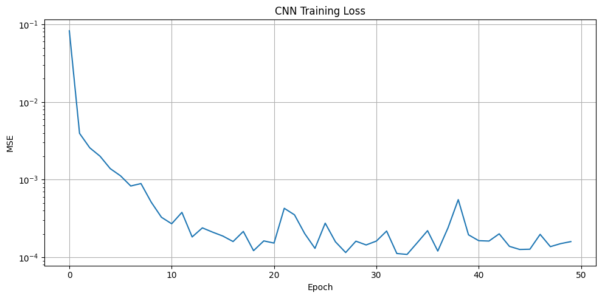 | 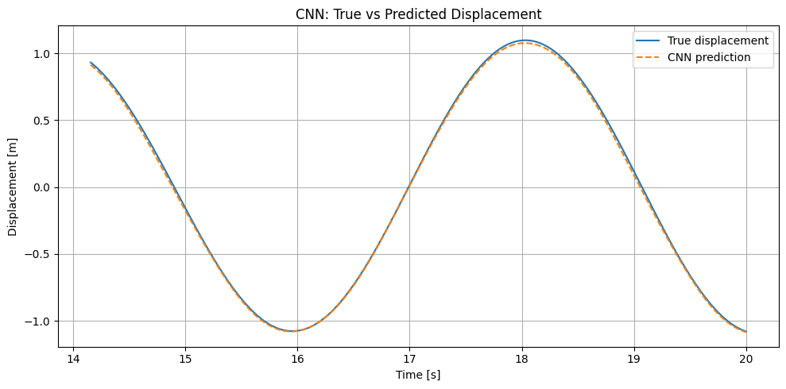 |

**One-step (teacher-forced) performance: `RMSE = 1.619e-02` m** — visually near-perfect tracking.

This looks like a success, but it's a much easier task than it appears: with $\Delta t \approx 0.01$ s, the signal barely changes between consecutive points, so the model is essentially interpolating a locally near-linear signal from 50 real neighboring points. The real test is what happens when those "real neighboring points" run out.

**Autoregressive rollout** — seeded only with the first 50 true test-region values, then fed exclusively on its own predictions from then on:

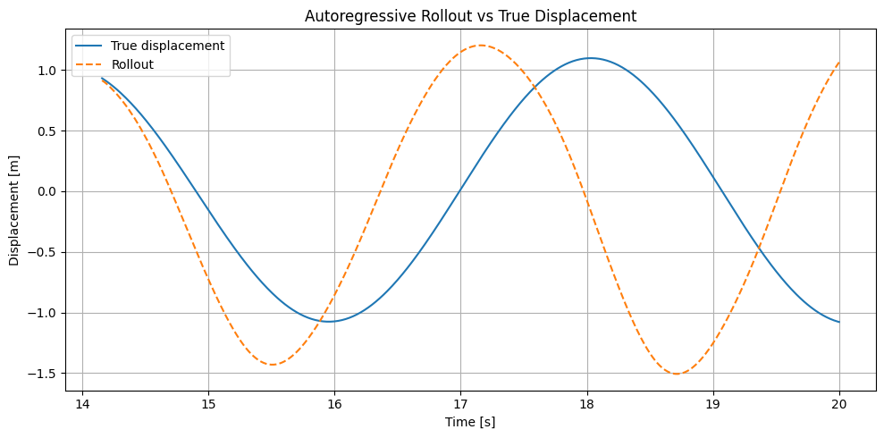

The rollout tracks the true trajectory closely for the first cycle, then visibly drifts in **both amplitude and phase** — by the end of the 6-second rollout window shown, the predicted peaks overshoot the true amplitude by roughly 30–40% and the oscillation is measurably out of phase with the ground truth. In a reproduction run under the same architecture and training settings, rollout RMSE was **~28× larger** than the one-step RMSE. *(Note: the notebook computes `rollout_mse`/`rollout_rmse` but doesn't print them — add a `print()` call to see the exact value for your own run; results will vary slightly run-to-run since no random seed is fixed.)*

---

### RNN: best one-step accuracy, but the most dramatic rollout failure

| Loss Curve | One-Step Prediction | Prediction Error |
|---|---|---|
| 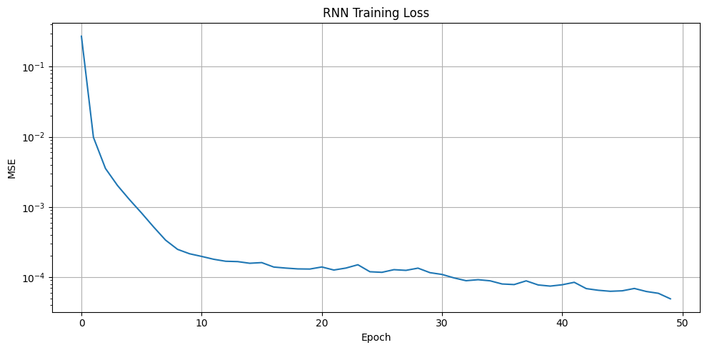 | 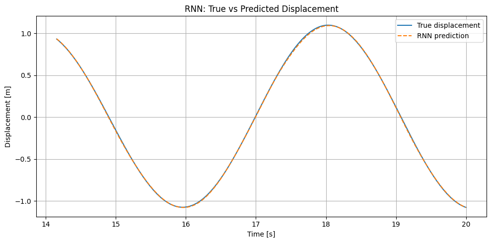 | 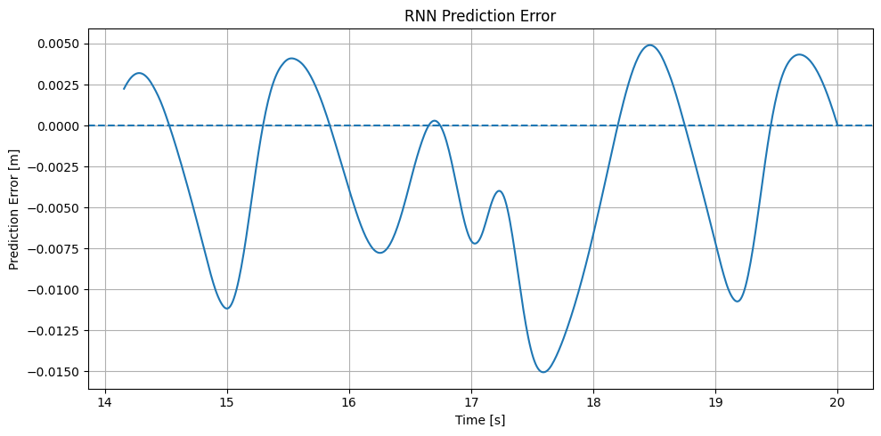 |

**One-step (teacher-forced) performance: `RMSE = 6.309e-03` m** — the best of the three architectures at this task, consistent with the RNN's hidden state being naturally suited to sequential, one-step-ahead prediction.

**Autoregressive rollout:**

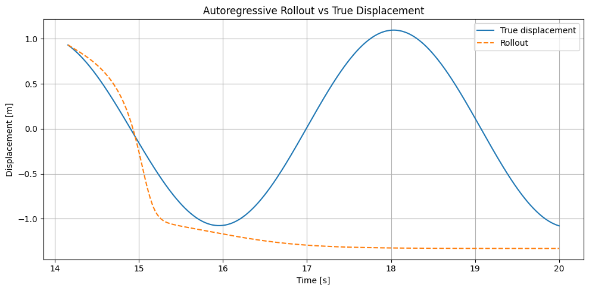

This is the most striking result in the whole project. Rather than drifting in amplitude/phase like the CNN, the RNN's rollout **collapses to a near-constant value** after about one cycle — the oscillation dies out entirely and the prediction flatlines. In a reproduction run, rollout RMSE was **~237× larger** than the one-step RMSE, roughly an order of magnitude worse than the CNN's rollout degradation.

This makes sense mechanistically: a simple (Elman) RNN with `tanh` recurrence has no explicit memory of "this system oscillates" — once its own slightly-imperfect predictions start feeding back in, the hidden state has no restoring mechanism (no spring stiffness, no energy conservation) to pull it back toward the correct trajectory, and it settles toward a fixed point instead.

---

### PINN: matches the data-driven models without ever seeing their data

| Training Loss (log scale) | Prediction vs. Numerical Solution |
|---|---|
| 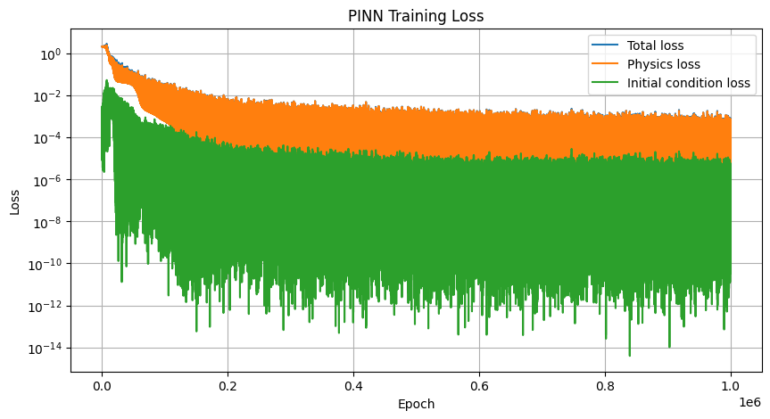 | 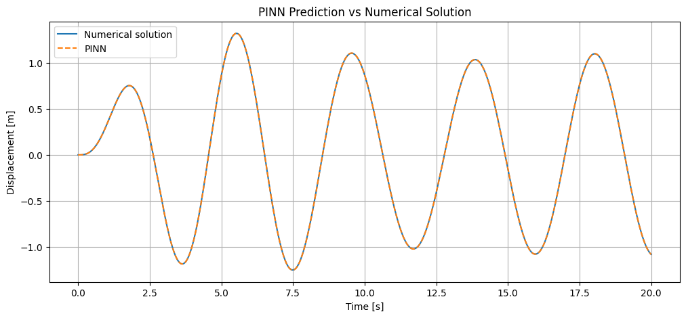 |

**Final performance, evaluated against the numerical solution (never used in training):**

| Quantity | RMSE |
|---|---|
| Displacement | **8.177e-04 m** |
| Velocity | 1.627e-03 m/s |
| Acceleration | 3.481e-03 m/s² |
| Physics residual | 1.221e-03 (mean \|residual\| = 1.014e-03, max = 6.142e-03) |

This is, by a wide margin, the most accurate model in the project — roughly **20× lower displacement RMSE than the RNN's one-step forecaster** (0.0063 m) and **690× lower than the MLP** (0.5615 m) — despite the PINN never once seeing a true $(t, x)$ pair. The prediction overlays the numerical solution almost exactly across all five oscillation cycles shown above; the error plot below stays bounded within about ±0.002 m for the entire 20-second domain, with no sign of the drift or flattening seen in the MLP:

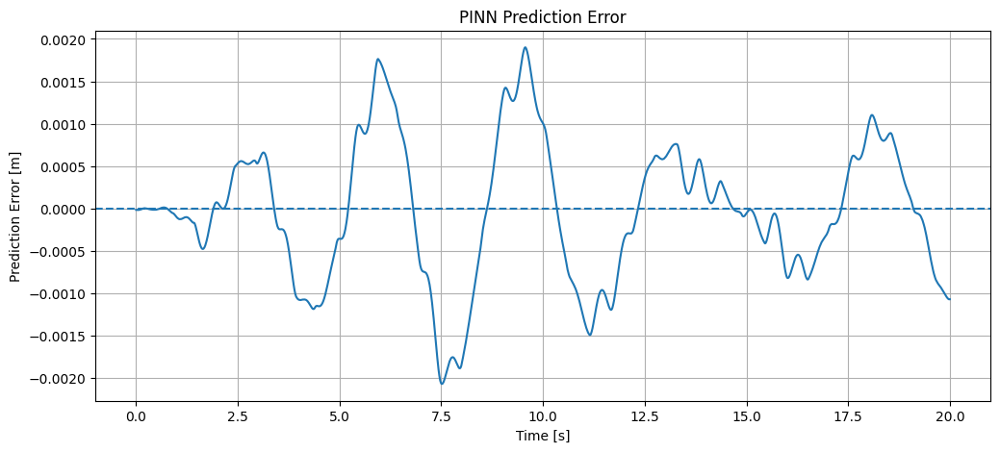

The loss curves show *why* this works. Both the physics loss and the initial-condition loss drop by close to six orders of magnitude over training and settle into a low, stable band — the oscillations visible late in training are expected noise from Adam's step size interacting with a loss that's already near its floor, not divergence. Driving the physics residual this low everywhere on the domain (not just at a finite set of training points) is what the ODE constraint buys over plain data-fitting: there's no "gap between training cycles" for the network to fall into the way the MLP's did.

**A capability none of the data-driven models have:** because $x_\theta(t)$ is a differentiable closed-form function of time, velocity and acceleration come for free from automatic differentiation — no separate model, no finite-difference approximation — and both match the numerical solution closely:

| Velocity vs. Numerical | Acceleration vs. Numerical |
|---|---|
| 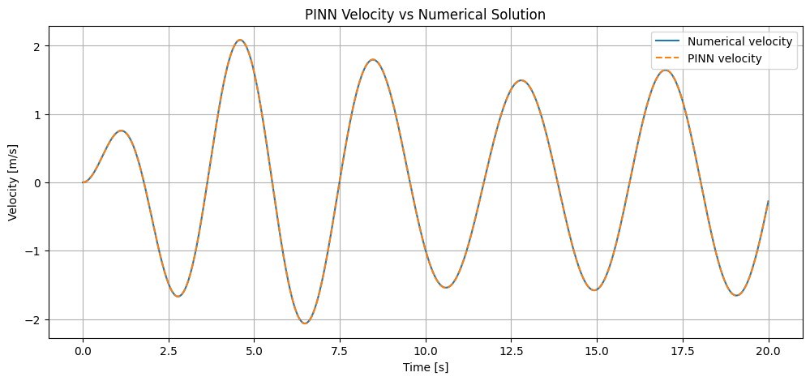 | 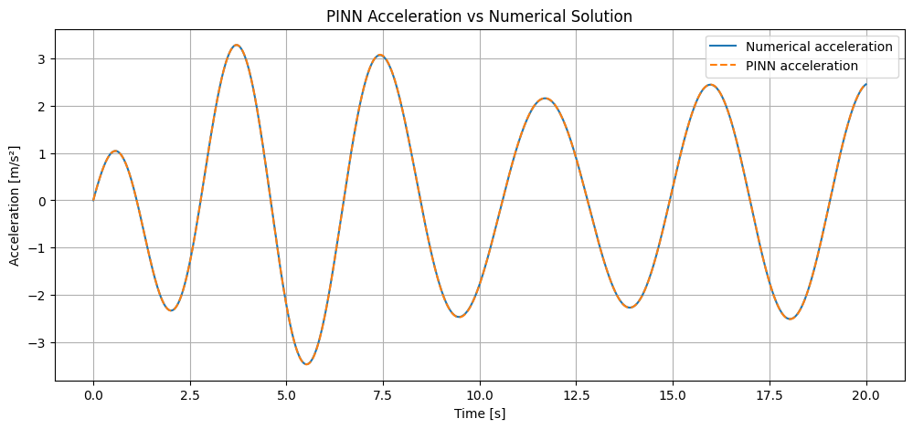 |

The physics residual itself — how far $m\ddot{x}_\theta+c\dot{x}_\theta+kx_\theta-F(t)$ is from zero, evaluated across the whole domain after training — stays small and bounded rather than growing over time:

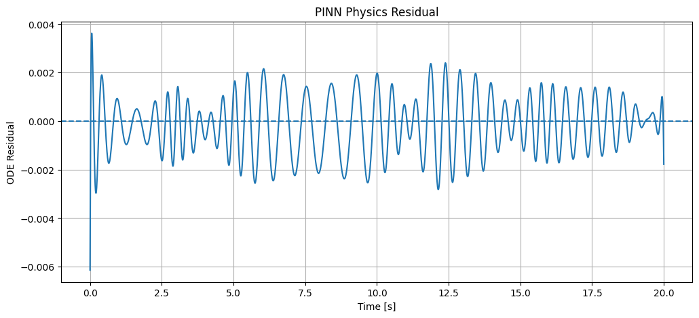

That boundedness is the direct payoff of training this way. The CNN and RNN's one-step forecasts were also highly accurate, but only with true recent history fed in at every step (see their rollout failures above); the PINN has no such crutch; it is a single function fit to satisfy the ODE everywhere, and it holds up over the full domain without ever being handed a ground-truth trajectory point.

---

## 5. Summary Comparison

| Model | Task Formulation | Metric | Value | Notes |
|---|---|---|---|---|
| **MLP** | $t \to x(t)$, full-domain fit | RMSE | **0.5615 m** | Fails to converge even on training data; flattens after ~3 cycles |
| **CNN** | 50-step window → next point | One-step RMSE | **0.0162 m** | Near-perfect with true history fed in |
| **CNN** | same, autoregressive | Rollout RMSE | **~0.5–1.1 m*** | Drifts in amplitude & phase |
| **RNN** | 50-step window → next point | One-step RMSE | **0.0063 m** | Best one-step accuracy of the three |
| **RNN** | same, autoregressive | Rollout RMSE | **~0.8–1.0 m*** | Collapses to a flat, non-oscillating value |
| **PINN** | ODE residual + IC only, zero displacement data | Displacement RMSE | **0.000818 m** | Best of all five models; error stays bounded across the full domain |

<sub>*Rollout figures marked with an asterisk are from an independent reproduction run under matching hyperparameters, since the shipped notebooks compute these values but do not print them. Signal amplitude is ~1.3 m, so these errors are on the same order as the signal itself.</sub>

**The central pattern:** the MLP, CNN, and RNN each perform reasonably — even impressively — when allowed to lean on either the full training set (MLP interpolation) or ground-truth history (CNN/RNN one-step forecasting). The moment that crutch is removed — extrapolating beyond training in the MLP's case, or running freely without ground-truth feedback in the CNN/RNN case — every one of their errors grows to the same order of magnitude as the signal itself. None of the three knows *why* the system oscillates the way it does; they only know how to locally pattern-match what they've already seen. The PINN breaks that pattern entirely: trained on **zero** displacement data, constrained only by the ODE and the initial conditions, it beats all three data-driven models' best reported RMSE and keeps its error bounded across the whole domain rather than localized to wherever training data happened to be dense.

---

## 6. Key Takeaway: Data-Driven Models vs. PINNs

None of these networks has any notion of $m$, $c$, $k$, or the requirement that acceleration relates to the net spring, damping, and forcing terms. Each is a purely data-driven pattern matcher, and all three architectures reveal a version of the same underlying problem once they're pushed past the exact conditions they were trained/evaluated under:

- The MLP cannot represent a sustained oscillation from a bare time input.
- The CNN and RNN can track the signal beautifully one step at a time, but have no internal constraint keeping a freely-running (autoregressive) prediction physically consistent — nothing enforces that energy behaves correctly, that the restoring force scales with displacement, or that the motion should keep oscillating rather than decay to a fixed point.

The **PINN implementation in `pinn.ipynb`** takes a different approach: it trains without displacement labels, using the ODE residual itself,

$$\mathcal{L}_{\text{physics}} = \left\| m\ddot{x}_{\theta} + c\dot{x}_{\theta} + kx_{\theta} - F(t) \right\|^2$$

along with the initial-condition loss, at 2000 collocation points spanning the full domain. Automatic differentiation supplies the derivatives of the network output directly — no finite differencing, no separate velocity/acceleration model. The numerical dataset is used only to score the result afterward, never during training.

The outcome is the clearest evidence in this project for why the physics constraint matters: trained on zero displacement data, the PINN reaches a displacement RMSE of 8.18e-4 m — about 20× lower than the RNN's best (data-supervised, one-step) result and nearly three orders of magnitude lower than the MLP, which was trained directly on every point it was evaluated against and still failed to fit the oscillation. Enforcing the governing equation at every point in the domain, rather than hoping a network infers it from samples, is what closes that gap.

---

## 7. How to Reproduce

```bash
# 1. Clone the repository
git clone https://github.com/BLACKMAMBA-2408/Neural-Networks-Performance-In-Predicting-A-Simple-Mass-Spring-System-s-Performance.git
cd Neural-Networks-Performance-In-Predicting-A-Simple-Mass-Spring-System-s-Performance

# 2. Install dependencies (see Requirements below)
pip install numpy scipy matplotlib torch

# 3. Run in order
jupyter notebook physics.ipynb   # generates mass_spring_data.csv — run this first
jupyter notebook mlp.ipynb
jupyter notebook cnn.ipynb
jupyter notebook rnn.ipynb
jupyter notebook pinn.ipynb
```

`physics.ipynb` must be run first (or `mass_spring_data.csv` must already be present) since the MLP, CNN, RNN, and PINN notebooks use that dataset. The PINN does not use the displacement data as a training target; it loads the CSV only for post-training evaluation.

> **Note:** `pinn.ipynb` currently loads the CSV from a hardcoded Kaggle path (`/kaggle/input/datasets/.../mass_spring_data.csv`) left over from development. Update that `np.loadtxt(...)` call to the relative path `"mass_spring_data.csv"` (matching the other notebooks) before running it outside Kaggle, or it will raise `FileNotFoundError`.

---

## 8. Limitations and Future Work

- **No fixed random seed in the MLP/CNN/RNN notebooks.** They use PyTorch's default RNG state, so exact loss/RMSE values will vary slightly between runs (the qualitative failure patterns described above are consistent, but precise numbers are not bitwise-reproducible). `pinn.ipynb` is the exception — it sets `torch.manual_seed(42)`, so its results are reproducible as reported.
- **Unfair task comparison between the data-driven models.** The MLP solves a different problem (full-domain coordinate regression) than the CNN/RNN (windowed forecasting). A stronger architecture comparison would give all three models the same windowed input so raw representational power can be compared directly.
- **Rollout metrics aren't printed in the CNN/RNN notebooks** — they're computed (`rollout_mse`, `rollout_rmse`) but never displayed; add a `print()` statement to capture exact values per run.
- **No baseline models.** A naive persistence predictor (repeat the last known value) or simple linear extrapolation would help quantify how much of the CNN/RNN's one-step accuracy is really architectural skill versus the task being locally easy at this sampling rate.
- **Hardcoded Kaggle path in `pinn.ipynb`.** See the note in [How to Reproduce](#7-how-to-reproduce) — needs a relative path to run outside Kaggle.
- **PINN training is 1,000,000 Adam epochs on CPU with no early stopping,** which is far more than needed — the loss curve is already flat well before the halfway point. An Adam → L-BFGS schedule (common in PINN literature) would likely reach the same or better accuracy in a fraction of the time.
- **No extrapolation test for the PINN.** The MLP's failure and the CNN/RNN's rollout collapse were both tested beyond the exact conditions each model was trained on; the PINN was only evaluated on the same domain its collocation points covered. Testing it on t > 20s — which costs nothing to set up, since the physics loss needs no labelled data there either — would be a natural next experiment and a direct comparison to the data-driven models' extrapolation failures.

---

## 9. Requirements

- Python 3.9+
- `numpy`
- `scipy`
- `matplotlib`
- `torch`

---

*Author: BLACKMAMBA-2408*
